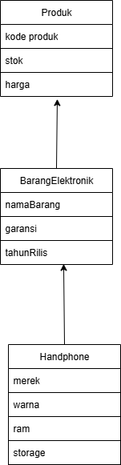

# Janji

Saya **Putri Ramadhani** dengan NIM **2410975** mengerjakan Tugas Praktikum 2 dalam mata kuliah Desain Pemrograman Berbasis Objek.
Maka dengan itu saya tidak melakukan kecurangan seperti yang telah dispesifikasikan, aamiin.

# Diagram
1. Class Produk, class ini merupakan kelas parents atau kelas utama dari class BarangElektronik  dan class Handphone. Class Produk ibarat parent tertua yang nantinya akan mewarisi kelas kelas lain
2. Class BarangElektronik, class ini merupakan anak dari class Produk atau diwariskan dari class Produk yang mana class BarangElektronik is Class Produk atau sebaliknya ynag mana kedua kelas itu memiliki hubungan inheritence
3. Class Handphone, class ini merupakan child dari class BarangElektronik ynag mana juga mewariskan dari class Produk, jadi ketiga kelas tersebut meililki hubungan inheritence yang mana disebut multilevel inheritence

# Penjelasan Atribut dan Method
 ## 1.class Produk 
   class produk memiliki 3 atribut yaitu:
   1.kodeProduk, yaiut kode untuk untuk tiap produk
   2.stok, yaitu jumlah barang atau produk yang masih tersedia
   3.harga, yaitu harga dari sebuah produk tersebut
## 2 class BarangElektronik
    class ini memliki 3 atribut yaitu:
     1.namaBarang, yaitu namaBarang dari sebuah produk atau barang tersebut
     2.garansi, yaitu lama garansi barang tersebut dalam tahun
     3.tahunRilis, yaitu tahun produk saat barang itu rilis/diproduksi
## 3.class Handphone
   kelas ini memiliki 4 atribut yaitu:
   1.merek, merek dari barang/handphone tersebut
   2.warna, warna dari hp tersebut
   3.ram, kapasitas ram dari produk/barang hp tersebut
   4.storage, kapasitas penyimpanan hp tersbut

Di 3 kelas tersebut dan di 4 bahasa sama sama menggunakan method getter setter dan constructor untuk dipakai saat buat objek baru yamg mana constructor untuk menginisialisasi objek saat dibuat, getter untuk mengambil nilai atribut, dan setter untuk mengubah nilai atribut, hanya berbeda di penulisannya: di C++ dan Java harus mencantumkan tipe data serta modifier, di Python cukup pakai def tanpa tipe data, sedangkan di PHP pakai function dengan $this-> untuk akses atribut.

# Alur Program

## 1. Inisial Data Awal,5 objek awal
   Program pertama kali akan membuat 5 objek dan menyimpannya ke dalam wadah
   vector di C++, list di Python, ArrayList di Java, array di PHP. Saat di   run maka sudah ada data yang bisa ditampilkan

## 2. Menampilkan pilihan input data atau show table dan juga exit
   1.Add data-->menambah data baru
   2.show table-->menampilkan data dalam tabel
   3.exit
   
## 3. Input Data Baru(Add Data)
   kalau user input 1 maka program akan meminta input sesuai format yaitu:
   kodeProduk stok harga namaBarang garansi tahunRilis merek warna ram storage, lalu data baaru akan ditambhkan ke wadah data    atau list/array atau vector jika di c++

## 4. Menampilkan Data dalam Bentuk Tabel
   Kalau user piih 2(show table), program akan mencetak semua data handphone dalam bentuk tabel dan format tabel diatur dengan tabel dinamis yaitu:
   c++ pakai setw()dan manual garis tabel
   python pakai library dari tabulate
   java pakai system.out.format()
   php pakai html <table>

## 5. Loop
   C++, Python, Java → program jalan dalam loop (do-while, while True, atau while) supaya user bisa memilih Add/Show berulang kali, sedangkan PHP dengan halaman web, input lewat form lalu setelah submit langsung reload halaman dengan data baru muncul di tabel

## 6. Keluar Program
   Program berakhir ketika user pilih Exit atau kalau di PHP cukup dengan menutup halaman web

## Diagram
 

## bukti c++

## bukti python

## bukti java

## bukti php

 

   
   
    
   
   

   
   

 

   
   

